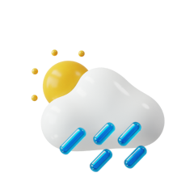

<!-- PROJECT LOGO -->
 

  

  <h3 align="center">EarthWeather</h3>

  

    Find out what the weather is going on in the places you want to know!
     
  

<!-- TABLE OF CONTENTS -->

  
Table of Contents

  <ol>
    <li>
      <a href="#about-the-project">About The Project</a>
      <ul>
        <li><a href="#built-with">Built With</a></li>
      </ul>
    </li>
    <li>
      <a href="#getting-started">Getting Started</a>
    </li>
        <li>
      <a href="#what-i-learned">What I learned</a>
    </li>
    <li>
      <a href="#installation">Installation</a></li>
    </li>
    <li>
      <a href="#contributing">Contributing</a>
  </li>
    <li>
      <a href="#contact">Contact</a>
  </li>
  </ol>

<!-- ABOUT THE PROJECT -->
## About The Project

See the demo on the link below!
 
[DEMO](https://github.com/nandaiqbalh/earth-weather/tree/master/APLICATION_DEMO)

(<a href="#top">back to top</a>)

## Built With

This app is made with Java on Android Studio.
* [Java](https://www.java.com/en/)
* API from [Openweathermap](https://openweathermap.org/)

(<a href="#top">back to top</a>)

<!-- GETTING STARTED -->
## Getting Started

EarthWeather is an application to detect the weather, both the weather of the user's current location and the weather of other cities that you want to find out. This application is suitable for friends who may want to travel and need weather forecasts to prepare for travel.

## Installation
Do these steps to run this app on your Android Studio :
1. Download this repository.
2. Extract the file in the directory you want.
3. Open the extracted folder via your android studio.

(<a href="#top">back to top</a>)

## What I Learned

In this application, I learned several things.
1. Android Activity Lifecycle
2. MVC Design Pattern
3. Gradle Dependency Management 
4. Networking (call and fetch data from API)

(<a href="#top">back to top</a>)

<!-- CONTRIBUTING -->
## Contributing

Contributions are what make the open source community such an amazing place to learn, inspire, and create. Any contributions you make are **greatly appreciated**.

If you have a suggestion that would make this better, please fork the repo and create a pull request. You can also simply open an issue with the tag "enhancement".
Don't forget to give the project a star! Thanks again!

1. Fork the Project
2. Create your Feature Branch (`git checkout -b feature/AmazingFeature`)
3. Commit your Changes (`git commit -m 'Add some AmazingFeature'`)
4. Push to the Branch (`git push origin feature/AmazingFeature`)
5. Open a Pull Request

(<a href="#top">back to top</a>)

<!-- CONTACT -->
## Contact

Nanda Iqbal Hanafi - [@nandaiqbalh](https://instagram.com/nandaiqbalh) - nandaiqbalhanafii@gmail.com

Project Link: [https://github.com/nandaiqbalh/earth-weather](https://github.com/nandaiqbalh/earth-weather)

(<a href="#top">back to top</a>)

